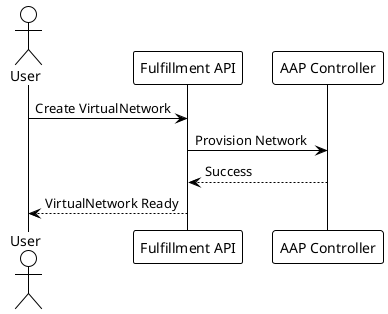

# AGENTS.md — docs

Documentation-only repository containing architecture guides, feature documentation, and developer guides for the OSAC project. No application code, no build system, no tests — pure Markdown content with PlantUML diagrams.

## What This Repo Contains

**Architecture documentation** (`architecture/`)
- `cluster-fulfillment.md` — Cluster fulfillment workflows
- `vm-fulfillment.md` — VM fulfillment patterns
- `publicip-networking.md` — PublicIP networking architecture
- `aap-provisioning/` — AAP provisioning state machines and sequence diagrams (PlantUML sources)
- `bm-server-fulfillment.md` — Bare metal server fulfillment

**Developer guides** (`guides/developer/`)
- Tenant setup procedures
- ComputeInstance creation workflows
- InstanceType management (create, list, update, delete)
- PublicIP allocation examples

**Feature documentation** (`features/`)
- `MGMT-22670-console-access.md` — Console access patterns
- `netris-caas-networking.md` — Netris CaaS networking integration

**Networking lab guides** (`networking/`)
- `setup-bpg-vrf-lite/README.md` — ClusterUserDefinedNetwork (CUDN) with provider network integration lab

**Root documentation**
- `designdoc.md` — AI-in-a-Box high-level design document (working document)
- `importing-esi-nodes.md` — Steps to import an ESI node into ACM
- `personas.md` — User archetypes and use cases
- `AI-POLICY.md` — Transparency and disclosure requirements for AI-assisted contributions
- `README.md` — Project overview and contribution workflow

**Diagrams**: PlantUML source files (`.puml`) with container-based PNG generation. Standalone images (`images/`) support root-level documents.

## File Organization

```text
docs/
├── architecture/
│   ├── aap-provisioning/         # AAP state machines, sequence diagrams, PlantUML generation script
│   ├── bm-server-fulfillment.md
│   ├── cluster-fulfillment.md
│   ├── publicip-networking.md
│   ├── README.md
│   └── vm-fulfillment.md
├── features/
│   ├── MGMT-22670-console-access.md
│   ├── netris-caas-networking.md
│   └── README.md
├── guides/
│   └── developer/
│       ├── computeinstance-guide.md
│       ├── instancetype-guide.md
│       ├── publicip-guide.md
│       └── tenant-setup.md
├── images/                        # Standalone diagrams for root-level docs
├── networking/
│   └── setup-bpg-vrf-lite/        # CUDN provider network integration lab
├── AI-POLICY.md
├── designdoc.md
├── importing-esi-nodes.md
├── LICENSE
├── OWNERS                         # Prow approvers/reviewers
├── personas.md
└── README.md
```

## Development Workflow

### Setup

Clone via fork-based workflow:
```bash
git clone git@github.com:<your-username>/docs.git
cd docs
git remote add origin git@github.com:osac-project/docs.git
```

**Note**: The fork-based workflow uses `fork` remote for your fork and `origin` remote for the upstream osac-project/docs repository.

No dependencies to install, no services to run. Use any Markdown editor.

### Editing Documentation

1. **Find or create an issue** at https://github.com/osac-project/docs/issues
2. **Get stakeholder feedback** on proposed changes before starting
3. **Create a feature branch** with descriptive name (e.g., `feat/update-vm-fulfillment-guide`)
4. **Edit Markdown files** directly
5. **Regenerate diagrams** if modifying `.puml` files (see below)
6. **Commit with DCO sign-off**: `git commit -s`
7. **Add AI attribution** if AI-assisted:
   ```text
   Assisted-by: Claude Code <noreply@anthropic.com>
   ```

### PlantUML Diagram Generation

If you modify `.puml` files in `architecture/aap-provisioning/`:

```bash
cd architecture/aap-provisioning/
./generate_images.sh  # Requires Docker or Podman
```

The script:
- Uses `docker.io/plantuml/plantuml:latest` container
- Converts `.puml` to PNG with `:Z` SELinux label for volume mounts
- Moves generated images from `diagrams/` to `images/` subdirectory

**When to regenerate**: Only if you modified `.puml` source files. Pre-generated PNGs are committed to the repo.

**PlantUML file format**: PlantUML diagrams use simple text-based syntax. Example:


See existing `.puml` files in `architecture/aap-provisioning/diagrams/` for examples.

## Pull Request Workflow

### Before Opening PR

- Ensure all Markdown changes are complete
- Regenerate diagrams if you modified `.puml` files
- Verify internal links still resolve (check relative paths in `[text](../path/file.md)` links)
- Check that examples in developer guides are accurate
- Review content for factual accuracy against source code and actual behavior
- Ensure DCO sign-off is present on all commits (`git commit -s`)

### PR Process

1. **Push to your fork** (never push to `origin` upstream):
   ```bash
   git push fork <branch-name>
   ```

2. **Open PR** against `origin/main` (the upstream osac-project/docs repository)
   - Link the issue (e.g., "Closes #123")
   - Summarize documentation changes
   - Call out any new sections or restructuring

3. **Approval**: PR requires approval from `OWNERS` file reviewers:
   - **Approvers**: 22 total (9 architects + 6 leads + 7 managers)
   - **Reviewers**: 27 total (includes all 22 approvers + 5 additional contributors)
   - Need LGTM from at least one reviewer
   - Need `/approve` from at least one approver

4. **Merge** when all Prow checks pass and approvers sign off

## Documentation Conventions

### Markdown Style

- **Heading hierarchy**: Use `#` for title, `##` for major sections, `###` for subsections
- **Code blocks**: Fence with triple backticks and language identifier
- **Internal links**: Relative paths (e.g., `[Personas](../personas.md)`)
- **Examples**: Include concrete commands, API payloads, troubleshooting steps in developer guides

### Content Organization

- **Architecture docs**: Technical depth with sequence diagrams, state machines, component relationships
- **Feature docs**: User-facing explanations of what features do and how to use them
- **Developer guides**: Step-by-step procedures with examples and troubleshooting

### Diagram Best Practices

- **Image sizing**: Keep diagrams readable (max width ~1200px for high-DPI displays)
- **Alt text**: Always provide descriptive alt text for accessibility: ``
- **File format**: Use PNG for PlantUML-generated diagrams; SVG acceptable for other vector graphics
- **Placement**: Embed diagrams near the relevant text that explains them

### Cross-References

Link to related content in other OSAC repos:
- Enhancement proposals: `https://github.com/osac-project/enhancement-proposals`
- API definitions: `https://github.com/osac-project/fulfillment-service`
- Operator implementation: `https://github.com/osac-project/osac-operator`

### Versioning and Release-Specific Content

This repository documents the **current development version** of OSAC. There is no branching strategy for documentation versions — all content reflects the latest `main` branch state.

**If documenting version-specific behavior**:
- Add a note at the top of the section: `> **Note**: As of OSAC v1.2, behavior changed to...`
- Use conditional wording: "In versions prior to 1.2..." vs. "Starting in version 1.2..."
- Link to enhancement proposals for context on when features were introduced

**For breaking changes**: Update both the architecture docs and developer guides to reflect the new behavior, with callouts for users on older versions.

## Common Tasks

### Add a new architecture document

1. Create directory under `architecture/<feature-name>/`
2. Add `README.md` with architectural overview
3. Include diagrams (PlantUML or embedded images)
4. Update root `README.md` if it's a major new section
5. Cross-reference from related docs

### Update a developer guide

1. Navigate to `guides/developer/<guide-name>.md`
2. Update procedures, examples, or troubleshooting
3. Test commands/examples if they reference live systems
4. Add version context if behavior changed in a release

### Add PlantUML diagrams

Currently, PlantUML generation is only set up for `architecture/aap-provisioning/`:

1. Create `.puml` file in `architecture/aap-provisioning/diagrams/`
2. Run `architecture/aap-provisioning/generate_images.sh`
3. Commit both `.puml` source and generated PNG
4. Embed in Markdown: ``

**To add PlantUML diagrams in other directories**: Adapt the `generate_images.sh` script for the new location (update `SCRIPT_DIR`, `DIAGRAMS_DIR`, and `IMAGES_DIR` paths).

## Access Control

**OWNERS file** defines:
- **Approvers**: 22 total (9 architects + 6 leads + 7 managers)
- **Reviewers**: 27 total (includes all 22 approvers + 5 additional contributors)

Prow uses this file for PR approval workflows. To merge a PR, you need:
- LGTM from at least one reviewer
- `/approve` from at least one approver
- All CI checks passing

**CI Checks**: This repository has minimal automated checks (no build system, no tests). CI typically validates:
- DCO sign-off presence on commits
- Basic Markdown linting (if configured)
- Prow approval workflow compliance

## AI Policy Compliance

When using AI assistance (Claude Code, GitHub Copilot, etc.):

1. **Disclosure**: Add commit trailer:
   ```text
   Assisted-by: Claude Code <noreply@anthropic.com>
   ```
   or
   ```text
   Generated-By: Claude Code <noreply@anthropic.com>
   ```

2. **Review**: Verify factual accuracy of AI-generated documentation against source code and actual behavior

3. **Transparency**: Full policy in `AI-POLICY.md` — read before contributing AI-assisted documentation

## Troubleshooting

### PlantUML Generation Failures

**Container not found**:
```bash
docker pull docker.io/plantuml/plantuml:latest
# or
podman pull docker.io/plantuml/plantuml:latest
```

**SELinux permission denied**:
- The `:Z` flag in the volume mount should handle SELinux contexts automatically
- If issues persist, check SELinux mode: `getenforce`
- Temporarily test with `sudo setenforce 0` (re-enable after: `sudo setenforce 1`)

**Syntax errors in .puml files**:
- Validate PlantUML syntax at http://www.plantuml.com/plantuml/uml/
- Check for missing `@startuml` / `@enduml` tags
- Verify theme compatibility (use `!theme plain` for consistency)

### Merge Conflicts

When updating documentation that others have modified:
```bash
git fetch origin
git rebase origin/main
# Resolve conflicts in Markdown files
git add <resolved-files>
git rebase --continue
git push fork <branch-name> --force-with-lease
```

### DCO Sign-Off

Configure git to automatically sign off commits:
```bash
git config --global user.name "Your Name"
git config --global user.email "your.email@example.com"
# Always use -s flag: git commit -s
```

Or set up a commit template with DCO trailer in `~/.gitmessage`.

## Security Notes

- **Public repository**: All content is open-source under Apache 2.0 license
- **No secrets**: Documentation contains no credentials, API keys, or sensitive data
- **Container security**: PlantUML generation script uses official Docker Hub image with SELinux-aware volume mounts (`:Z` flag)
- **Access control**: GitHub-based with OWNERS file integration

## Key Files

| File | Purpose |
|------|---------|
| `OWNERS` | Prow approver/reviewer definitions |
| `AI-POLICY.md` | AI assistance disclosure requirements |
| `personas.md` | User archetypes referenced in architecture docs |
| `README.md` | Project overview and contribution workflow |
| `architecture/aap-provisioning/generate_images.sh` | PlantUML diagram generation |

## Related Repositories

Documentation references code and designs from:
- `fulfillment-service` — gRPC API definitions and server implementation
- `osac-operator` — Kubernetes operator for cluster/VM provisioning
- `osac-aap` — Ansible Automation Platform roles
- `enhancement-proposals` — Design RFCs and feature proposals
- `osac-installer` — Installation manifests and setup scripts

When documenting new features, verify implementation details in the relevant component repo before finalizing architecture or developer guide content.

## Quick Reference

```bash
# Clone your fork
git clone git@github.com:<username>/docs.git
cd docs
git remote add origin git@github.com:osac-project/docs.git

# Create feature branch
git checkout -b feat/update-architecture-docs

# Edit Markdown files
vim architecture/cluster-fulfillment.md

# Regenerate diagrams (if needed)
cd architecture/aap-provisioning/
./generate_images.sh
cd ../..

# Commit with DCO and AI attribution
git add .
git commit -s -m "Update cluster fulfillment architecture

Document new HostedControlPlane integration patterns.

Assisted-by: Claude Code <noreply@anthropic.com>"

# Push to fork
git push fork feat/update-architecture-docs

# Open PR via GitHub UI
# Link issue, summarize changes, wait for review
```
