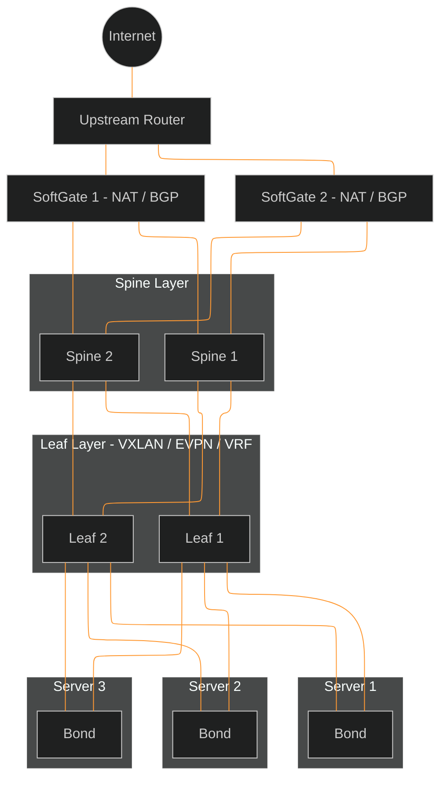
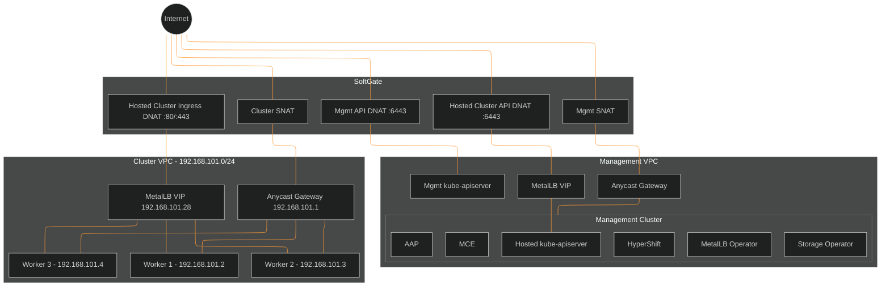

# Netris CaaS Networking

This document describes how network traffic flows through the OSAC
infrastructure when using Netris as the network backend. It covers the
physical underlay (switches, softgates, uplinks), the logical overlay (VPCs,
NAT rules), and the packet-level path for each traffic direction.

## Netris Component Roles

The Netris fabric has three component types, each with a distinct role in the
data plane:

| Component | What it is | Data-plane role |
|-----------|-----------|-----------------|
| **Switch** (leaf/spine) | Physical network switch running a Netris agent | L2/L3 forwarding for all traffic (east-west and north-south), VXLAN encapsulation, EVPN, anycast gateway, VRF isolation, ACL enforcement. Does NOT perform NAT. |
| **SoftGate** | x86 server at the fabric edge running Netris gateway software | All NAT (SNAT/DNAT), L4 load balancing, BGP peering with upstream routers, default route injection into VPCs. The internet gateway. |
| **Controller** | Centralized management server | Pure control plane. Translates intent (VPC, NAT rule, server cluster) into device configs pushed to switches and softgates via gRPC. Not in the data path. |

## Physical Underlay

The physical fabric follows a spine-leaf Clos topology. SoftGates sit at the
top, connecting to the upstream router (internet) and the spine layer.
Servers connect to leaf switches via bonded VPC NICs for redundancy. The
Netris Controller manages all devices but is not in the data path.



Each server has two VPC NICs bonded across both leaf switches. Spine
switches form a full mesh between all leafs. SoftGates peer with the
upstream router via BGP, advertising public IPs (/32) for DNAT and receiving
default routes for outbound traffic.

## Logical Overlay

The overlay runs on top of the physical fabric using VXLAN tunnels and VRFs
on the leaf switches. Each hosted cluster gets its own VPC (isolated VRF).
The SoftGate is the gateway between VPCs and the internet.



The management VPC and each cluster VPC are separate VRFs on the same
physical switches. The SoftGate bridges them to the internet:

- **SNAT** on both VPCs gives their nodes outbound internet access
- **API DNAT** on the management VPC routes `:6443` to the kube-apiserver LB
  on the hosting cluster (because HyperShift runs the apiserver there)
- **Ingress DNAT** on the cluster VPC routes `:80/:443` to the MetalLB VIP
  on the worker nodes (because the ingress controller runs there)

Note the anycast gateway and MetalLB VIP serve different roles in the
cluster VPC. The **anycast gateway** (`192.168.101.1`) is the default route
for egress — worker nodes send all outbound traffic through it, and the
leaf switch forwards it to the SoftGate for SNAT. The **MetalLB VIP**
(`192.168.101.28`) handles ingress — it is an L2 address advertised via ARP
directly on a worker node's NIC, so DNAT'd packets from the SoftGate reach
it without passing through the gateway.

### How the components interact

**Switches** (spine and leaf layers) carry all traffic through the fabric —
both east-west (server-to-server) and north-south (server-to-SoftGate-to-internet).
They use VXLAN overlays with BGP EVPN for MAC/IP learning. Each VPC maps to
a VRF on the switches, providing routing table isolation. V-Nets within a
VPC get unique VXLAN Network Identifiers (VNIs). Leaf switches also run
anycast gateways — every leaf hosting a VPC advertises the same gateway IP
and MAC, so traffic is routed at the nearest leaf without tromboning.

**SoftGates** connect to the leaf switches and to the upstream router. They
are the only path to the internet. When a NAT rule is created for a VPC, the
SoftGate injects a default route (`0.0.0.0/0`) into that VPC's VRF on the
switches, steering all outbound traffic through itself. SoftGates also
advertise public IPs (DNAT destinations) as /32 routes to the upstream
router via BGP, attracting inbound traffic. All NAT translation happens on
the SoftGate — switches never rewrite packet headers.

**Controller** pushes configuration to switches and SoftGates via gRPC. If
the controller goes down, devices continue forwarding with their last-known
config — only new changes stop.

## Overlay: VPCs and Per-Cluster Resources

Each hosted cluster operates across two VPCs and a management network:

| Plane | Purpose | Scope |
|-------|---------|-------|
| **Management VPC** | Hosts the hosting cluster control plane (MCE, HyperShift, kube-apiserver pods). Shared across all hosted clusters. | One per site |
| **Per-cluster VPC** | Dedicated L3 network for each hosted cluster's worker nodes. Auto-created when a Netris server cluster is provisioned. Maps to a VRF + VNI on the switches. | One per hosted cluster |
| **Management network** | Out-of-band access to bare-metal servers via their management NIC (DHCP). Used for SSH-based NMState configuration. Not managed by Netris. | Flat, site-wide |

### Per-cluster resources created by Netris

| Resource | Name | Where it lives |
|----------|------|----------------|
| Server cluster | `<cluster-name>` | Controller config, pushed to switches |
| VPC (VRF + VNI) | `<cluster-name>` (auto-created) | Switch VRF tables |
| Anycast gateway | `192.168.101.1` on every leaf with cluster members | Switch SVIs |
| SNAT rule | `<cluster-name>-snat` | SoftGate NAT table |
| API DNAT rule | `<cluster-name>-api-dnat` | SoftGate NAT table |
| Ingress HTTP DNAT | `<cluster-name>-ingress-http-dnat` | SoftGate NAT table |
| Ingress HTTPS DNAT | `<cluster-name>-ingress-https-dnat` | SoftGate NAT table |
| DNS A records | `api.`, `api-int.`, `*.apps.` | Route53 |

Each cluster consumes **3 public IPs** from the Netris IPAM NAT pool: 1 for
SNAT, 1 for the API DNAT, and 1 for the ingress DNAT.

### Bare-metal server NIC layout

Each worker node has two types of network interfaces:

| Interface | Example | IP assignment | Connected to |
|-----------|---------|---------------|-------------|
| Management NIC | `eno1` | DHCP (unchanged from PXE boot) | Management network (not Netris-managed) |
| VPC NIC(s) | `ens1f0np0`, `ens1f1np1` | Static (first NIC only) | Leaf switch port (Netris-managed, VXLAN access port) |

The routing table on each node:

| Destination | Gateway | Interface | Metric | Effect |
|-------------|---------|-----------|--------|--------|
| `0.0.0.0/0` (default) | VPC anycast gateway (`192.168.101.1`) | VPC NIC | 50 | All data traffic goes through leaf switch into VPC |
| Management CIDR | Management gateway | Mgmt NIC | 100 | Bastion/controller traffic stays on mgmt network |

## Management Plane: NMState Configuration via SSH

Network configuration on live servers is applied through the management
network, not the data plane:

```
Ansible controller
  -> SSH to bastion (management network)
    -> SSH to server mgmt NIC (eno1, DHCP IP)
      -> nmstatectl apply: configures VPC NICs with static IPs and routes
```

This two-hop path ensures the management connection is never disrupted by
the VPC reconfiguration it triggers — the management NIC and routes are left
untouched.
