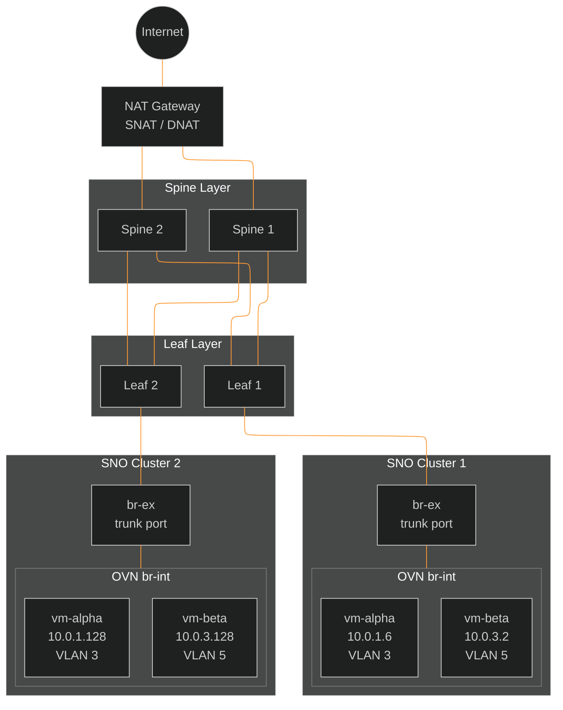
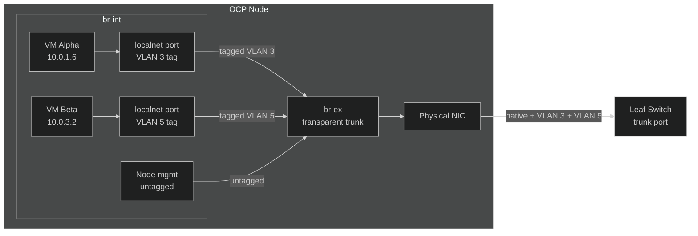
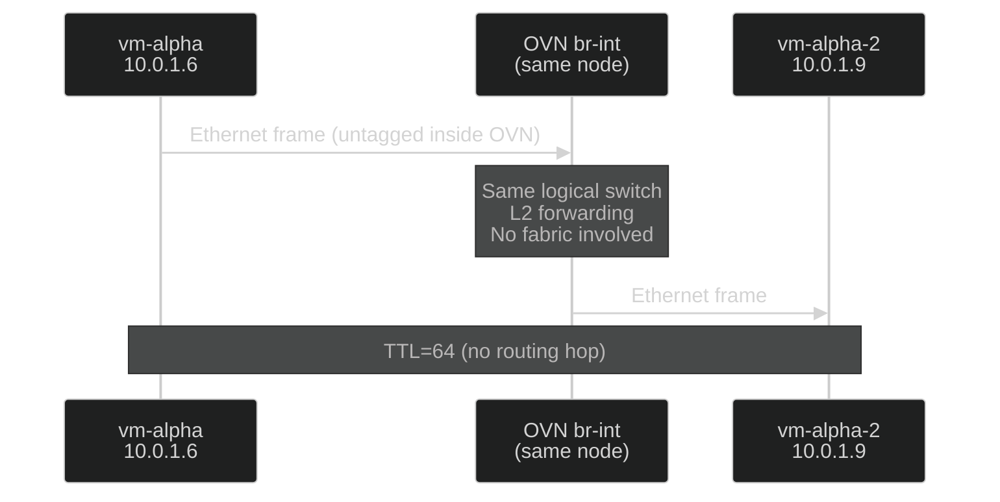
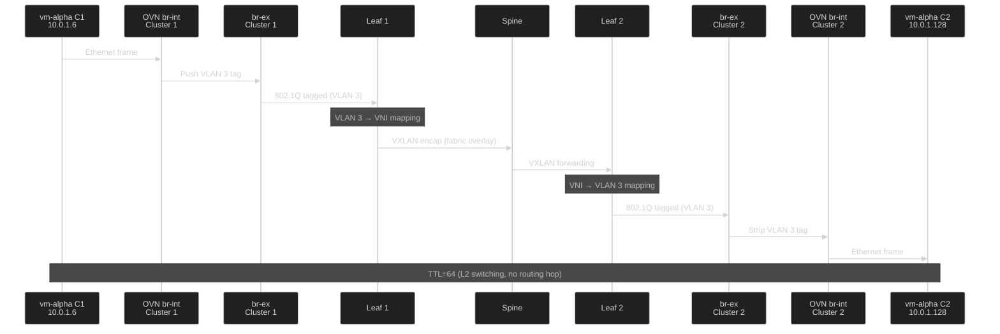
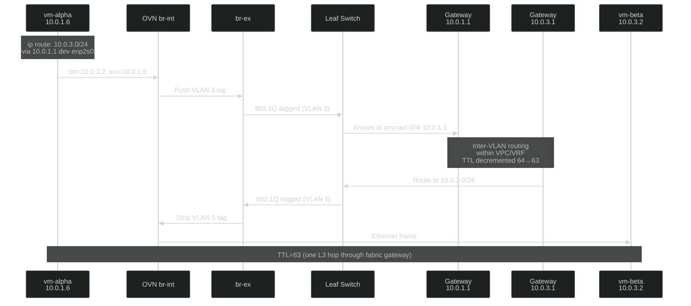
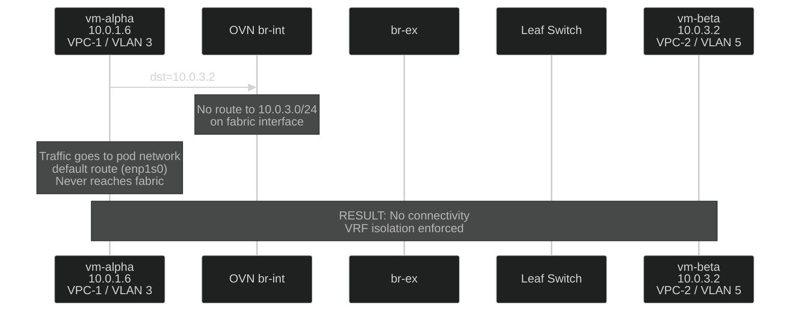
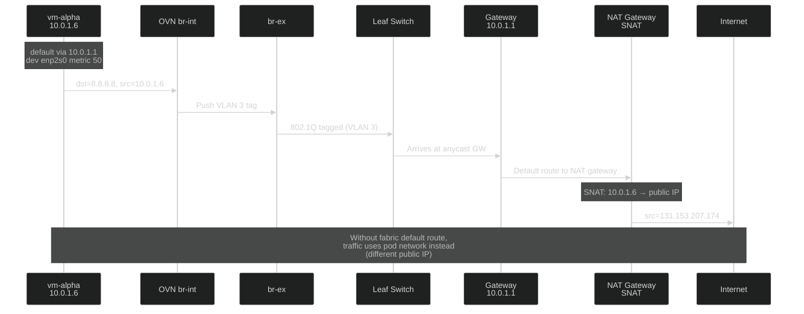
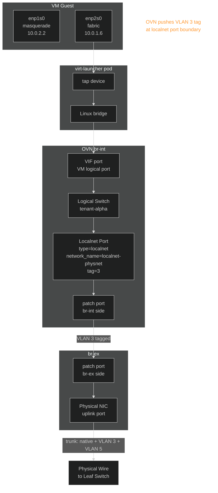
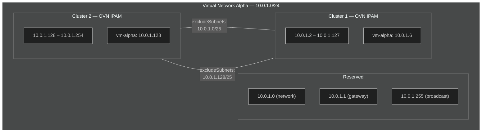

# CUDN Localnet Networking Flow Diagrams

## Physical Topology

Two SNO clusters connected to a spine-leaf fabric. Each node has a
single data NIC on br-ex, connected to a leaf switch as a trunk port.

## Single Switch Port: VLAN Multiplexing on br-ex

A single physical NIC carries all traffic. OVN tags VM frames with the
appropriate VLAN at the br-int localnet port. br-ex passes everything
transparently as a trunk.

## Flow 1: Same Virtual Network, Same Cluster (L2)

Traffic stays within OVN on the same node — never hits the fabric.
Both VMs are on the same OVN logical switch.

## Flow 2: Same Virtual Network, Cross-Cluster (L2)

Both VMs are on the same VLAN. Traffic exits br-ex tagged, traverses
the fabric as a VXLAN/EVPN segment between leaf switches, and enters
the remote node's br-ex where OVN strips the tag.

## Flow 3: Different Virtual Networks, Same VPC/VRF (L3 Routed)

VMs are on different VLANs but share a VPC/VRF. The fabric leaf gateway
performs inter-VLAN routing. Requires explicit routes on VMs.

## Flow 4: Different Virtual Networks, Different VPCs/VRFs (Isolated)

VMs are on different VLANs in different VRFs. The fabric has no routing
path between the VRFs. Traffic is dropped.

## Flow 5: SNAT via Fabric

VM traffic exits through the fabric to the NAT gateway when a default
route via the fabric gateway is configured.

## OVN Internal Architecture

How OVN bridges localnet traffic from a VM to the physical wire.

## Multi-Cluster IP Partitioning

How `excludeSubnets` prevents IP collisions across clusters sharing
the same virtual network.

