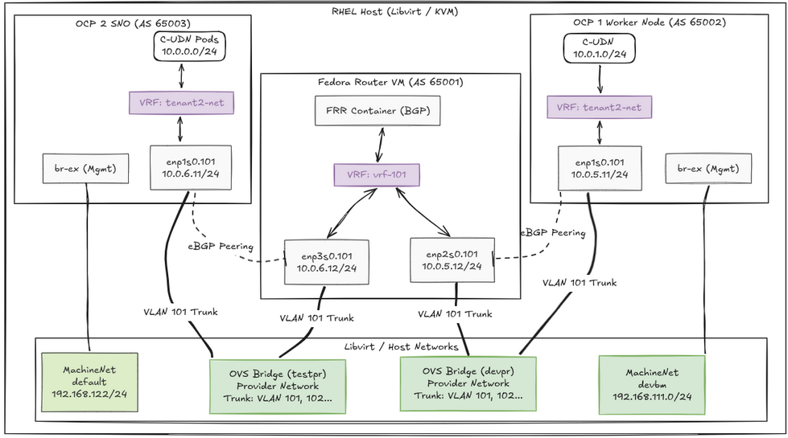

# **CUDN with Provider Network Integration**

## **Overview & Architecture**

This lab demonstrates how to implement a **ClusterUserDefinedNetwork (CUDN)**
integrated with a Managed Service Provider (MSP) network fabric using **BGP**
and **VRF-Lite**.

- **CUDN Isolation:** A Kubernetes namespace (or group of namespaces) is
  assigned to a CUDN. This allows pods to receive IP addresses outside the
  cluster’s primary Pod CIDR, providing complete network isolation at the
  workload level.
- **Provider Network Integration:** The OpenShift (OCP) cluster nodes peer with
  the MSP network fabric using BGP.
- **Architecture Decision:** We are using **VRF-Lite**. We use a dedicated VLAN
  for each CUDN and peer to the fabric over this VLAN interface. This preserves
  CUDN isolation end-to-end within the customer network.

### **Nomenclature**

| Term | Meaning |
|:---|:---|
| **BGP** | Border Gateway Protocol; used to exchange routes between the cluster and the router/fabric. |
| **ASN** | Autonomous System Number; identifies a BGP speaker. |
| **CUDN** C | lusterUserDefinedNetwork; an OCP resource that defines a user-defined network (e.g. Layer2) and which namespaces use it. In this setup the CUDN is the **primary** network for pods and Kubevirt Virtual Machines in those namespaces. |
| **FRR** | Free Range Routing; routing suite used on the cluster (via the FRR provider) and in this lab on the router VM. |
| **MSP** | Managed Service Provider; the operator that owns both the cluster and the router/fabric the cluster peers with. |
| **OVN-Kubernetes** | OpenShift’s default network provider; provides CUDN and route advertisement integration. |
| **RouteAdvertisements** | OCP resource that controls which networks (e.g. CUDN pod subnets) are advertised over BGP. |
| **VLAN** | Virtual LAN; a layer-2 segment used to carry one tenant’s traffic between workers and the router. |
| **VRF** | Virtual Routing and Forwarding; an isolated routing table so tenant traffic is kept separate. |
| **VRF-Lite** | Each CUDN uses a dedicated VLAN and VRF end-to-end: traffic is isolated per tenant using separate routing tables and layer-2 segments, without a tunneling overlay. |

## **References**

- **Red Hat Documentation:**
  - [Advertising Pod IPs from a User-Defined Network over BGP with
    VPN](https://docs.redhat.com/en/documentation/openshift_container_platform/4.21/html/advanced_networking/route-advertisements#advertising-pod-ips-from-a-user-defined-network-over-bgp-with-vpn_about-route-advertisements)
  - [About the ClusterUserDefinedNetwork
    CR](https://docs.redhat.com/en/documentation/openshift_container_platform/4.21/html/multiple_networks/primary-networks)
- **Git repo - <https://github.com/eranco74/ocp-cudn-vrflite-lab>**

**Topology and lab overview**

This lab runs everything as VMs on a **single RHEL host** (Libvirt/KVM): OCP
nodes and a Fedora router VM. You can instead use a cluster provisioned
elsewhere (existing or provisioned using
[Assisted-Installer](https://console.redhat.com/openshift/assisted-installer/clusters/~new))
and a **real router** or MSP fabric; the per-tenant steps are the same.

<figure>

<figcaption aria-hidden="true">Topology</figcaption>
</figure>

**Bird’s-eye view: expected setup**

Summary of actions to configure a CUDN + BGP + VRF-Lite setup:

- **Initial (one-time):**
  - **Cluster:** Provision or use OCP with OVN-Kubernetes; enable routing via
    host, FRR provider, route advertisements, global IP forwarding; workers must
    allow VLAN/VRF configuration (manual, NMState, or MSP).
  - **Router/fabric:** Deploy the router or fabric that will peer with the
    cluster; define BGP peering subnets and ASNs.
- **Per-tenant:**
  - **Cluster:** Namespace + CUDN (pod subnet); on each worker create VLAN,
    attach to CUDN’s VRF, set BGP peering address; create FRRConfiguration and
    RouteAdvertisements.
  - **Router/fabric:** Expose tenant VLAN to router; create VRF and VLAN
    interface with peering address; configure BGP in that VRF to peer with
    cluster and accept only the tenant’s pod subnet (MSP typically does this in
    production).

## **Part I — Initial setup (one-time)**

Do this once; then repeat **Part II** for each tenant.

### **I.1 Cluster provisioning and operator preparation**

In this lab the cluster is provisioned with dev-scripts on the same host as the
router VM; any cluster with OVN-Kubernetes, host networking control on workers,
and a supported OCP version is fine (existing or provisioned using
[Assisted-Installer](https://console.redhat.com/openshift/assisted-installer/clusters/~new)).

**Provision the cluster (this lab: dev-scripts on the host)**

If you install the cluster some other way, skip to the next section **Enable
cluster-wide networking options**.

Run on the host that will act as hypervisor (or from your usual provisioning
environment if the cluster is elsewhere):

        # Clone the dev-scripts repository
        git clone https://github.com/openshift-metal3/dev-scripts.git
        cd dev-scripts
        cat << EOF > config_root.sh
        export OPENSHIFT_RELEASE_STREAM=4.19
        export WORKING_DIR=/root/dell/disks/dev-scripts
        export CLUSTER_NAME=new
        export BASE_DOMAIN=redhat.com
        export IP_STACK=v4
        export BMC_DRIVER=redfish-virtualmedia
        export NUM_WORKERS=2
        export MASTER_VCPU=10
        export MASTER_MEMORY=36000
        export WORKER_DISK=200
        export MASTER_DISK=200
        export NUM_EXTRA_WORKERS=0
        export VM_EXTRADISKS=true
        export VM_EXTRADISKS_LIST=vda vdb
        export VM_EXTRADISKS_SIZE=200G
        EOF

        # Provision the cluster
        make

**Enable cluster-wide networking options (run from a workstation with `oc`
logged in)**

These patches enable routing via the host, the FRR provider, route
advertisements, and global IP forwarding so OVN-Kubernetes can use the host’s
secondary interfaces for CUDN/VRF traffic.

`oc patch network.operator.openshift.io/cluster --type=merge -p '{"spec":{"defaultNetwork":{"ovnKubernetesConfig":{"gatewayConfig":{"routingViaHost":true}}}}}'`

`oc patch network.operator.openshift.io/cluster --type=merge -p '{"spec":{"additionalRoutingCapabilities":{"providers":["FRR"]}}}'`

`oc patch network.operator cluster --type=merge --patch '{"spec":{"defaultNetwork":{"ovnKubernetesConfig":{"routeAdvertisements":"Enabled"}}}}'`

`oc patch network.operator.openshift.io cluster --type=merge -p='{"spec":{"defaultNetwork":{"ovnKubernetesConfig":{"gatewayConfig":{"ipForwarding":"Global"}}}}}'`

### **I.2 Router VM provisioning and configuration**

These steps run on the **hypervisor**—the host that runs the router VM. In this
lab that is the same single machine running the OCP cluster VMs. The host must
have OVS and libvirt. The Fedora VM simulates a BGP router; in production or a
more realistic lab you can use a **real router** (or MSP fabric) instead—the
per-tenant router steps are in Part II (II.4–II.6).

**I.2.1 Create the OVS bridge and libvirt network**

Run on the hypervisor host. The bridge will be used by the router VM (and
optionally a second cluster).

        sudo ovs-vsctl add-br testpr

        cat << 'EOF' > testpr.xml
        <network>
          <name>testpr</name>
          <forward mode='bridge'/>
          <bridge name='testpr'/>
          <virtualport type='openvswitch'/>
        </network>
        EOF

        virsh net-define testpr.xml
        virsh net-start testpr
        virsh net-autostart testpr

### **I.2.2 Provision the Fedora Router VM**

Run on the hypervisor. Download the image and create the VM:

        wget https://download.fedoraproject.org/pub/fedora/linux/releases/43/Server/x86_64/images/Fedora-Server-Guest-Generic-43-1.6.x86_64.qcow2
        sudo cp Fedora-Server-Guest-Generic-43-1.6.x86_64.qcow2 /var/lib/libvirt/images/router-vm.qcow2

        virt-install \
          --name router-vm \
          --ram 2048 \
          --vcpus 2 \
          --os-variant fedora39 \
          --disk path=/var/lib/libvirt/images/router-vm.qcow2,format=qcow2,size=20 \
          --import \
          --network network=default \
          --network network=devpr \
          --network network=testpr \
          --graphics vnc \
          --noautoconsole

### **I.2.3 Enable SSH access on the router VM**

Connect to the VM using the VNC console (or `virsh console router-vm`) and
configure the initial user/root password if prompted.

Log in and edit the SSH configuration to allow remote access:
`sudo vi /etc/ssh/sshd_config`

Look for these two lines and ensure they look exactly like this (uncommented):

    PasswordAuthentication yes
    PermitRootLogin yes

Restart the SSH service to apply the changes: `sudo systemctl restart sshd`

Find the VM’s assigned IP address on the default network and SSH into it for the
remaining configuration steps:

        virsh net-dhcp-leases default
        ssh root@<router-vm-ip>

--------------------------------------------------------------------------------

## **Part II — VRF-Lite per tenant (repeat for each tenant)**

For each tenant configure **cluster side** (II.1–II.3) and **router side**
(II.4–II.6). Use `oc` from your workstation; run VLAN/VRF/address commands on
each worker via `oc debug node/…` or SSH (or NMState in production).

### **Addressing in this lab**

Example ranges (keep consistent and non-overlapping):

- **CUDN pod subnet** (e.g. `10.0.1.0/24`): for pods in the tenant network.
- **BGP peering subnet** (e.g. `10.0.5.0/24`): underlay between worker VLAN
  interface and router (e.g. worker `10.0.5.11/24`, router `10.0.5.12/24`).

### **II.1 Create the tenant namespace and CUDN**

Run from your workstation with `oc`. Creating the ClusterUserDefinedNetwork
causes the cluster to create a VRF on each worker (the VRF name matches the CUDN
name). Example for tenant `tenant1` and CUDN `tenant1-net`:

        cat << 'EOF' > tenant1_ns.yaml
        apiVersion: v1
        kind: Namespace
        metadata:
          name: tenant1
          labels:
            k8s.ovn.org/primary-user-defined-network: ""
            network: tenant1-net
        EOF

        oc apply -f tenant1_ns.yaml

        cat << 'EOF' > cudn.yaml
        apiVersion: k8s.ovn.org/v1
        kind: ClusterUserDefinedNetwork
        metadata:
          name: tenant1-net
          labels:
            export: "true"
        spec:
          namespaceSelector:
            matchLabels:
              network: tenant1-net
          network:
            topology: Layer2
            layer2:
              role: Primary
              subnets: [10.0.1.0/24]
              ipam: {lifecycle: Persistent}
        EOF

        oc apply -f cudn.yaml

The `subnets: [10.0.1.0/24]` is the pod subnet for this CUDN; choose a range
that does not overlap with the cluster network or the machine network.

### **II.2 Host network configuration on each worker**

Perform these steps on **every worker node**. To get a shell on a worker, run
`oc debug node/<worker-node-name>` (or SSH if you have direct access). Replace
the primary interface name (e.g. `enp1s0`) and VLAN id (e.g. `101`) with the
values for your environment. The VRF name is the CUDN name (e.g. `tenant1-net`).

Identify the primary interface: `ip a`

Create the VLAN device and bring it up:

        sudo ip link add link enp1s0 name enp1s0.101 type vlan id 101
        sudo ip link set dev enp1s0.101 up

Verify: `ip a | grep enp1s0.101`

Link the VLAN to the CUDN’s VRF and add an address in the BGP peering subnet.
Use a different IP per worker (e.g. `10.0.5.11/24` on worker 1). Bounce the link
so the kernel moves routes into the VRF:

        sudo ip link set dev enp1s0.101 master tenant1-net
        sudo ip addr add 10.0.5.11/24 dev enp1s0.101
        sudo ip link set dev enp1s0.101 down
        sudo ip link set dev enp1s0.101 up

Check the VRF and route table:

        ip vrf show
        ip route show vrf tenant1-net

### **II.3 Create FRRConfiguration and RouteAdvertisements**

Run from your workstation with `oc`. These two custom resources work together:

- **FRRConfiguration:** Tells the FRR provider on the cluster how to run BGP for
  this tenant. It defines a BGP router in the given VRF (`tenant1-net`) that
  peers with the external router at `10.0.5.12` (ASN `65001`); the cluster side
  uses ASN `65002`. The FRR pods on the workers will establish the BGP session
  in that VRF.
- **RouteAdvertisements:** Tells OVN-Kubernetes which networks to advertise over
  BGP. It selects FRRConfigurations via the label
  (`routeAdvertisements: tenants-frr`) and specifies that the **PodNetwork** of
  selected CUDNs (those with label `export: "true"`) should be advertised. So
  the tenant’s pod subnet (e.g. `10.0.1.0/24`) is announced to the router.

Adjust names and labels if you use multiple FRRConfiguration resources.

        cat << 'EOF' > frr.yaml
        apiVersion: frrk8s.metallb.io/v1beta1
        kind: FRRConfiguration
        metadata:
          name: tenant1
          namespace: openshift-frr-k8s
          labels:
            routeAdvertisements: tenants-frr
        spec:
          bgp:
            routers:
            - asn: 65002
              neighbors:
              - address: 10.0.5.12
                asn: 65001
                disableMP: true
                dualStackAddressFamily: false
                toReceive:
                  allowed:
                    mode: all
              vrf: tenant1-net
          nodeSelector: {}
        EOF

        oc apply -f frr.yaml

        cat << 'EOF' > routead.yaml
        apiVersion: k8s.ovn.org/v1
        kind: RouteAdvertisements
        metadata:
          name: advertise-vrf-lite
        spec:
          targetVRF: auto
          advertisements:
          - "PodNetwork"
          nodeSelector: {}
          frrConfigurationSelector:
            matchLabels:
              routeAdvertisements: tenants-frr
          networkSelectors:
          - networkSelectionType: ClusterUserDefinedNetworks
            clusterUserDefinedNetworkSelector:
              networkSelector:
                matchLabels:
                  export: "true"
        EOF

        oc apply -f routead.yaml

For a second tenant, repeat Part II with a new namespace/CUDN (e.g. `tenant2`,
`tenant2-net`), a different VLAN id (e.g. `102`), and a distinct BGP peering
subnet or IPs per worker.

### **II.4 Configure hypervisor VLAN trunking**

The router VM must receive each tenant’s VLAN. Edit the VM’s XML
(`virsh edit router-vm`) and add a `<tag id="…"/>` for each tenant (e.g. `101`
for the first tenant). For the first tenant:

          <vlan trunk="yes">
            <tag id="101"/>
          </vlan>

When you add another tenant later, add another tag (e.g. `<tag id="102"/>`) and
restart the VM. Verify with `ovs-vsctl show`.

### **II.5 Configure router OS network (VRF/VLAN)**

On the router you create a dedicated VRF and VLAN interface with an address in
the BGP peering subnet. In production the **MSP has the responsibility** for
this router-side setup; here we do it manually inside the router VM. Repeat the
following for each tenant (first tenant example below).

Inside the router VM:

- Create a VRF device so BGP and routes for this tenant use an isolated routing
  table (table 101):

        sudo ip link add vrf-101 type vrf table 101
        sudo ip link set vrf-101 up

- Create the VLAN interface (id 101, matching the segment used on the OCP
  workers), attach it to the VRF, and set the router’s address on the BGP
  peering subnet (`10.0.5.12/24`). The workers will use addresses in the same
  subnet (e.g. `10.0.5.11/24`).

        sudo ip link add link enp2s0 name enp2s0.101 type vlan id 101
        sudo ip link set enp2s0.101 master vrf-101
        sudo ip addr add 10.0.5.12/24 dev enp2s0.101

        sudo ip link set enp2s0.101 up

### **II.6 Deploy FRR on the router**

The router must run BGP in each tenant’s VRF and accept the pod subnets
advertised by the cluster. Here we run FRR in the router VM. You run the FRR
container once (below), but the config inside `frr.conf` is per-tenant: add a
VRF block, interface, prefix-list, route-map, and `router bgp … vrf …` for each
tenant. First tenant example below.

- **VRF and interface:** FRR is told about `vrf-101` and that `enp2s0.101` is in
  that VRF so BGP runs in the correct routing context.
- **Prefix-list and route-map:** We only accept this tenant’s CUDN pod subnet
  (`10.0.1.0/24`) from the cluster, not arbitrary routes.
- **BGP in vrf-101:** Router AS 65001 peers with the cluster at `10.0.5.11` (AS
  65002). The cluster advertises the pod network; the route-map limits what we
  install.

Inside the router VM (create config for the first tenant; add similar blocks for
more tenants later):

        sudo mkdir -p /var/lib/frr/etc/
        cat << 'EOF' | sudo tee /var/lib/frr/etc/frr.conf
        !
        frr version 9.1
        frr defaults traditional
        hostname UDMPRO
        log syslog informational
        service integrated-vtysh-config
        !
        vrf vrf-101
        exit-vrf
        !
        interface enp2s0.101
         vrf vrf-101
        exit
        !
        ip prefix-list ocp-hub seq 5 permit 10.0.1.0/24 le 32
        !
        route-map allow-ocp-hub permit 10
         match ip address prefix-list ocp-hub
        exit
        !
        router bgp 65001
        exit
        !
        router bgp 65001 vrf vrf-101
         bgp log-neighbor-changes
         no bgp default ipv4-unicast
         neighbor ocp-hub peer-group
         neighbor ocp-hub remote-as 65002
         neighbor 10.0.5.11 peer-group ocp-hub
         !
         address-family ipv4 unicast
          neighbor ocp-hub activate
          neighbor ocp-hub soft-reconfiguration inbound
          neighbor ocp-hub route-map allow-ocp-hub in
         exit-address-family
        exit
        !
        EOF

        echo "bgpd=yes" | sudo tee /var/lib/frr/etc/daemons

        sudo podman run -d --name frr --net=host --privileged \
          -v /var/lib/frr/etc:/etc/frr:Z \
          quay.io/frrouting/frr:9.1.0

--------------------------------------------------------------------------------

## **Testing & Debugging**

### **Verify router BGP session**

On the router VM:

        sudo podman exec -it frr vtysh -c "show vrf"
        # Check the BGP communication
        sudo podman exec -it frr vtysh -c "show bgp vrf vrf-101 summary"
        # See the routing tables
        sudo podman exec -it frr vtysh -c "show bgp vrf vrf-101 ipv4 unicast"

### **Network connectivity test**

From an OpenShift worker (SSH to the node), ping the router in the VRF:

`sudo ping -I enp1s0.101 10.0.5.12`

### **Pod troubleshooting (netshoot)**

From your workstation, deploy a debug pod in the tenant namespace to test
routing from inside a pod (e.g. `oc apply -f -` with the manifest below):

        apiVersion: v1
        kind: Pod
        metadata:
          name: test-pod
          namespace: tenant1
        spec:
          containers:
          - name: main
            image: registry.redhat.io/rhel9/support-tools:latest
            command: ["sleep", "infinity"]

### **Optional: Create a second cluster**

You can add a second OCP cluster (e.g. SNO via [Assisted Installer
SaaS](https://console.redhat.com/openshift/assisted-installer/clusters/~new)),
attach its VM to the libvirt default network and `testpr` (created in Part I),
then repeat the Part II steps for that cluster (create tenant NS and CUDN, then
on each node: check VRF, create VLAN device, enslave VLAN to VRF, add address).
On the second cluster’s nodes you will use that cluster’s interface name (e.g.
`enp7s0`) and the same VLAN id; the VRF name is the CUDN name (e.g.
`tenant2-net`). On the router VM, add a new VLAN interface and address for the
second cluster’s segment and extend `frr.conf` with the new BGP neighbor if
needed.

--------------------------------------------------------------------------------

**Optional: Worker sysctl for BGP/VRF**

If needed for your environment, apply a MachineConfig to set
`net.ipv4.tcp_l3mdev_accept=1` on workers:

    apiVersion: machineconfiguration.openshift.io/v1
    kind: MachineConfig
    metadata:
    labels:
        machineconfiguration.openshift.io/role: worker
    name: 99-worker-bgp-vrf-sysctl
    spec:
    config:
        ignition:
          version: 3.2.0
        storage:
          files:
          - contents:
              source: data:,net.ipv4.tcp_l3mdev_accept%3D1%0A
            mode: 420
            path: /etc/sysctl.d/99-bgp-vrf.conf
